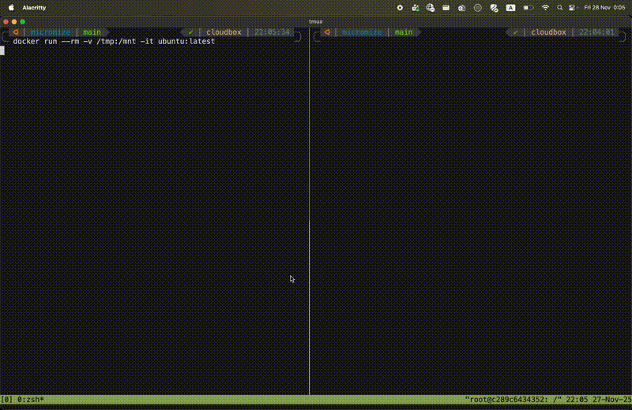

<h1>
  <picture>
    <source media="(prefers-color-scheme: light)" srcset="docs/images/logo/logo-horizontal.svg">
    
  </picture>
</h1>

`micromize` is a security hardening tool designed to detect and break the post-exploit kill chain for containerized applications, leveraging [BPF LSM](https://docs.ebpf.io/linux/program-type/BPF_PROG_TYPE_LSM/).



## Overview

Traditional container security often involves creating complex profiles (like Seccomp or SELinux) for each application to audit or restrict its capabilities. micromize flips this model. Instead of defining what each container can do, micromize applies a broad set of sensible restrictions to all containers running on a node, auditing and blocking dangerous flows that are rarely needed by legitimate containerized workloads and often used for container escapes.

By deploying micromize to your nodes, you instantly harden the entire node. You then manage exclusions for specific workloads that require broader permissions, rather than managing restriction profiles for everyone else.

## How it Works

`micromize` leverages [BPF LSM](https://docs.ebpf.io/linux/program-type/BPF_PROG_TYPE_LSM/) to enforce policies at the kernel level. It is built on top of [Inspektor Gadget](https://github.com/inspektor-gadget/inspektor-gadget), using a modular architecture to load and execute eBPF programs.

## Quickstart

### Docker

Run `micromize` as a Docker container:

```bash
# Pull the image
docker pull ghcr.io/micromize-dev/micromize:latest

# Run in enforce mode
docker run -it \
  --name micromize \
  --pid=host \
  --privileged \
  -v /sys/fs/bpf:/sys/fs/bpf \
  -v /sys/kernel/debug:/sys/kernel/debug \
  -v /sys/kernel/security:/sys/kernel/security:ro \
  -v /bin:/host/bin \
  -v /proc:/host/proc \
  -v /run:/host/run \
  -v /usr:/host/usr \
  ghcr.io/micromize-dev/micromize:latest
```

### Helm

Deploy `micromize` to your Kubernetes cluster using Helm:

```bash
helm install micromize ./charts/micromize \
  --namespace micromize \
  --create-namespace \
  --set image.tag=latest
```

## Development

### Prerequisites

Micromize is under active development and wasn't tested on a broad set of environments.
Currently, development is done on Linux kernel 6.11 with BPF LSM support.

We are using the [`ig`](https://inspektor-gadget.io/docs/latest/quick-start#linux) cli v0.46.0 for building gadgets (eBPF programs) that are embedded into the tool.

### Building

To build the binary locally:

```bash
make build-all
```

To build the Docker image:

```bash
docker buildx build --platform linux/amd64 -t micromize:latest . --load
```

### Running

`micromize` can run in two modes:

1.  **Enforce Mode** (Default): Blocks restricted actions and logs them.
    ```bash
    sudo dist/micromize-linux-[amd64|arm64] --enforce=true
    ```

2.  **Audit Mode**: Logs events without blocking. Useful for profiling workloads.
    ```bash
    sudo dist/micromize-linux-[amd64|arm64] --enforce=false
    ```

### Output

Events are output in JSON format to stdout.

```json
{"filename":"/mnt/ls","k8s":{"containerName":"","hostnetwork":false,"namespace":"","node":"","owner":{"kind":"","name":""},"podLabels":"","podName":""},"process":{"comm":"nope\n","creds":{"gid":0,"uid":0},"mntns_id":4026532763,"parent":{"comm":"nope\n","pid":2855519},"pid":2855685,"tid":2855685},"runtime":{"containerId":"a60a9c1bfe276bb228edc5b69799e93f81ad22b48df38352a61a4dab979de15a","containerImageDigest":"sha256:80dd3c3b9c6cecb9f1667e9290b3bc61b78c2678c02cbdae5f0fea92cc6734ab","containerImageName":"ubuntu:latest","containerName":"angry_satoshi","containerPid":2855519,"containerStartedAt":1764281145433600315,"runtimeName":"docker"},"timestamp_raw":5666551227589565}
```

